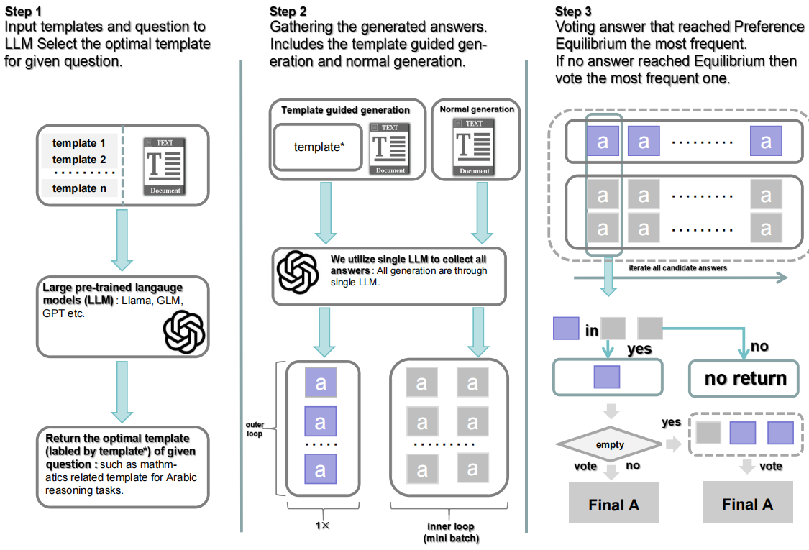

# Nash Chain-of-Thought (CoT)

### Description: This is the official codebase of Nash CoT

### What's CoT

(If you have no related-background knowledge about CoT, please read these papers [1,2,3] first) CoT is a *step-by-step* manner inference approach. This approach is composed of two steps. Step1: Generating rationals 

Here, we provide single case for CoT:

### The framework of Nash CoT:



### Configuration

```c
cd nash-chain-of-thought && pip install -r requirements.txt
```

### How to run our code?

```c
sh run_nash_cot.sh data_setname random_seed tokenizer_path model_path
```

### We list severl un-controllabel factors:

- We find that any 


### If you utilize our codebase, please cite below:

```c
@article{,
title={Nash CoT: Multi-Path Inference with Preference Equilibrium}, 
author={Ziqi Zhang and Cunxiang Wang and Xiong Xiao and Yue Zhang and Donglin Wang},
year={2024},
eprint={},
archivePrefix={arXiv},
}
```

### Thanks 

We utilize these models: GLM4-chat (9B)[4], Mistral-Instruct (7B)[5], we are also welcomed friends further evaluate Nash CoT with LLama3-Instruct [6], however, there are some concerns metioned above. 

Our codebase is modified from the codebase of Automatic CoT, and our local decoder is built based on Huggingface Transformer

Addtionally, thanks my collaberator: Cunxiang Wang

This reseach is supported by MiLab at WestLake Univeristy.

### Other details:

zero-shot/zero-shot-cot/self-consistency are implemented by ourself.

### *Reference*

[1] Jason Wei, Xuezhi Wang, Dale Schuurmans, Maarten Bosma, Brian Ichter, Fei Xia, Ed Chi, Quoc Le, Denny Zhou. 2022. Chain-of-Thought Prompting Elicits Reasoning in Large Language Models. Preprint. arXiv: 2201.11903.

[2] Xuezhi Wang, Jason Wei, Dale Schuurmans, Quoc Le, Ed Chi, Sharan Narang, Aakanksha Chowdhery, Denny Zhou. 2022. Self-Consistency Improves Chain of Thought Reasoning in Language Models. Preprint. arXiv: 2203.11171.

[3] Zhuosheng Zhang, Aston Zhang, Mu Li, Alex Smola. 2022. Automatic Chain of Thought Prompting in Large Language Models. Preprint. arXiv: 2210.03493.

[4] Aohan Zeng, Xiao Liu, Zhengxiao Du, Zihan Wang, Hanyu Lai, Ming Ding, Zhuoyi Yang, Yifan Xu, Wendi Zheng, Xiao Xia, Weng Lam Tam, Zixuan Ma, Yufei Xue, Jidong Zhai, Wenguang Chen, Peng Zhang, Yuxiao Dong, Jie Tang. 2022. GLM-130B: An Open Bilingual Pre-trained Model. Preprint. arXiv: 2210.02414.

[5] Albert Q. Jiang, Alexandre Sablayrolles, Arthur Mensch, Chris Bamford, Devendra Singh Chaplot, Diego de las Casas, Florian Bressand, Gianna Lengyel, Guillaume Lample, Lucile Saulnier, Lélio Renard Lavaud, Marie-Anne Lachaux, Pierre Stock, Teven Le Scao, Thibaut Lavril, Thomas Wang, Timothée Lacroix, William El Sayed. 2022. Mistral 7B. Preprint. arXiv: 2310.06825.

[6] 

# Collaberation 

If you can find out any kinds of new usages of Nash CoT, we are welcomed to be contacted and supplyment new emergent experimental results! For instance, 1) You conduct evaluation on LLama, GPT, etc. 2) You find out this approach can be scaled to other setting such as controllable generation  

Both of my E-mile (stevezhangz98a@gmail.com) and adding new blog to this project are welcomed. 
